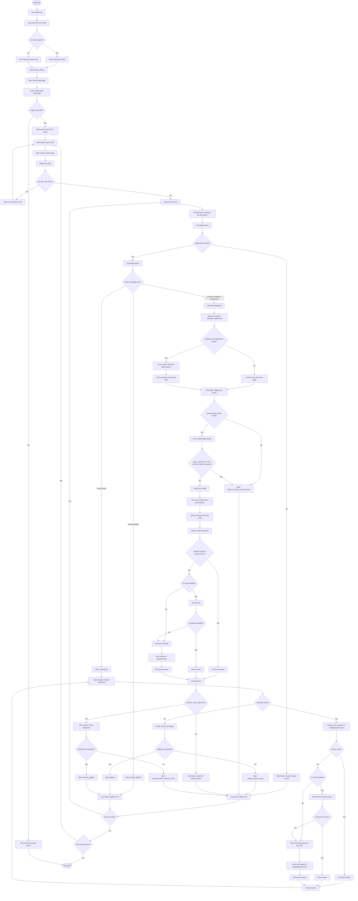

# Naukari Modular Bot — Application Flow

This flow explains the 3-file bot structure:

- `naukari.py` — main bot runner
- `in_naukari.py` — handles Naukri internal apply and chatbot questions
- `externalapply.py` — handles company-site / external apply flow



## Short execution summary

1. `naukari.py` starts the bot, loads config, starts Chrome, logs in to Naukri, searches jobs, and opens each job card.
2. When the apply button opens an internal Naukri flow, `naukari.py` sends control to `in_naukari.py`.
3. `in_naukari.py` handles Naukri chatbot questions using `config/questions.json`, Gemini AI, or manual popup answers.
4. When the apply button opens a company website, `naukari.py` sends control to `externalapply.py`.
5. `externalapply.py` searches the external page for the matching job, clicks Apply, fills forms, uploads resume, answers questions, and submits only when allowed by config.
6. Every result is logged into applied or failed CSV files.
```
